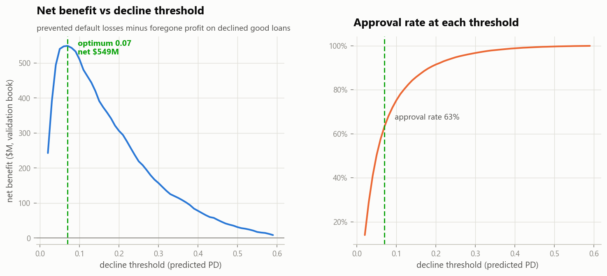

# Credit Scoring — turning a 0.774 AUROC model into a $578M decision

**Can we predict, at application time, which consumer loans will go bad — and what is that prediction worth in dollars?**

<p align="center">
  
</p>

| | Result |
|---|---|
| **Model** | Tuned gradient boosting — **0.774 test AUROC** (logistic baseline 0.757, +1.7 pts from nonlinear interactions) |
| **Generalization** | CV 0.768 ± 0.005 · validation 0.773 · sealed test 0.774 — three independent readings, same answer |
| **Decision rule** | Decline at PD ≥ 7% → **63.2% of applicants approved, 74.5% of defaults caught** |
| **Business value** | **+$578.7M net** on the 46,127-application test book ($972.0M losses prevented − $393.3M revenue foregone) |
| **Fairness** | Audit found **gender was a model input** — prohibited in credit decisions. Removed it for **0.0006 AUROC** |
| **Verdict** | **DEPLOY**, gender-free pipeline, with monitoring and manual review for thin-file applicants |

**Data:** Home Credit — 307,511 applications × 122 columns (8.07% default rate) plus
1,716,428 credit-bureau records from other lenders.

### Four things that make this more than a modeling exercise

1. **The threshold is a business dial.** The curve above prices *every* possible approval
   rate. Leadership picks the risk appetite; the model reports what it costs. This is the
   step that turns AUROC into a decision.
2. **Class weighting was refused on purpose.** The usual rare-event trick inflates
   predicted probabilities — and both the dollar math and the decline reasons need honest
   ones. Calibration is verified decile by decile instead.
3. **Adverse-action reasons are production-grade.** All **279 model features** map to
   consumer language; the fallback is a lawful generic phrase, never a column name.
4. **The monitoring alarm was test-fired.** A simulated severe recession (incomes −25%,
   scores −20%) drives PSI to **0.337** and trips the threshold — a tested control, not a
   promise.

```bash
python score_applicant.py --riskiest --waterfall
```
> Scores an applicant end to end and issues the decision plus its legally-required
> reasons. The riskiest applicant in the test set: 23 years old, 12 bureau records,
> **PD 72.6%**, declined — and did default.

## Repository layout

```
.
├── data/
│   ├── application_train.csv     ← 307,511 applications x 122 columns
│   ├── bureau.csv                ← 1,716,428 bureau records (joins on SK_ID_CURR)
│   └── processed/                ← clean splits, feature matrices, predictions (built by nb 02–04)
├── notebooks/
│   ├── 01_eda.ipynb              ← target imbalance, the sentinel hunt, who defaults
│   ├── 02_preprocessing.ipynb    ← sentinel audit, missingness strategy, stratified splits
│   ├── 03_feature_engineering.ipynb ← Five-Cs ratios, bureau aggregation, K-Means peer groups
│   ├── 04_modeling.ipynb         ← scorecard vs forest vs boosting, tuning, profit threshold
│   └── 05_explainability.ipynb   ← SHAP, adverse action, PSI, segments, fairness
├── src/                          ← all reusable code (cleaning, features, evaluation…)
├── models/
│   ├── credit_scoring_pipeline.pkl          ← champion (preprocessing + model, one artifact)
│   ├── credit_scoring_pipeline_nogender.pkl ← recommended: protected attribute removed
│   ├── logistic_baseline.pkl and peer_group_clusterer.pkl
├── reports/                      ← executive summary, model documentation, stability report
│   └── figures/                  ← every chart, publication-ready PNG
└── README.md
```

## The notebooks

Every notebook is committed with its outputs, so the results are readable without running anything.

| Notebook | What it covers | Fast view |
|---|---|---|
| [`01_eda.ipynb`](notebooks/01_eda.ipynb) | target imbalance, the sentinel hunt, who defaults | [open](https://nbviewer.org/github/kaustubhspatil/credit-scoring-decision-system/blob/main/notebooks/01_eda.ipynb) |
| [`02_preprocessing.ipynb`](notebooks/02_preprocessing.ipynb) | sentinel audit, missingness strategy, stratified splits | [open](https://nbviewer.org/github/kaustubhspatil/credit-scoring-decision-system/blob/main/notebooks/02_preprocessing.ipynb) |
| [`03_feature_engineering.ipynb`](notebooks/03_feature_engineering.ipynb) | Five-Cs ratios, bureau aggregation, K-Means peer groups | [open](https://nbviewer.org/github/kaustubhspatil/credit-scoring-decision-system/blob/main/notebooks/03_feature_engineering.ipynb) |
| [`04_modeling.ipynb`](notebooks/04_modeling.ipynb) | scorecard vs forest vs boosting, tuning, profit threshold | [open](https://nbviewer.org/github/kaustubhspatil/credit-scoring-decision-system/blob/main/notebooks/04_modeling.ipynb) |
| [`05_explainability.ipynb`](notebooks/05_explainability.ipynb) | SHAP, adverse action, PSI, segments, fairness | [open](https://nbviewer.org/github/kaustubhspatil/credit-scoring-decision-system/blob/main/notebooks/05_explainability.ipynb) |

> GitHub renders large notebooks slowly and sometimes gives up with *"Sorry, something went wrong."* The **Fast view** column opens the same file through nbviewer, which loads reliably.

## Reproduce end-to-end

Python 3.11+, no GPU needed:

```bash
pip install numpy pandas matplotlib scikit-learn joblib pyarrow scipy shap jupyter nbformat nbconvert ipykernel
jupyter notebook    # run notebooks 01 → 05 top to bottom
```

Or headless:

```bash
cd notebooks
for nb in 01_eda 02_preprocessing 03_feature_engineering 04_modeling 05_explainability; do
    python -m nbconvert --to notebook --execute --inplace $nb.ipynb
done
```

**Live scoring demo** (the Day-10 presentation walkthrough) — scores an applicant
end to end and prints the decision plus its adverse-action reasons:

```bash
python score_applicant.py --riskiest --waterfall
```

Approximate runtimes on a modern laptop: 01 ≈ 4 min, 02 ≈ 2 min, 03 ≈ 5 min,
04 ≈ 25 min (model training + randomized search), 05 ≈ 8 min.

## Design decisions that matter

- **Split first, fit second.** Stratified 70/15/15; the test split is sealed until its
  single opening in notebook 04 §6. All fitted transforms (imputers, encoders, the
  clusterer, models) live inside sklearn Pipelines, so CV re-fits them per fold and
  leakage is structurally impossible.
- **Sentinels are fixed, not ignored:** `DAYS_EMPLOYED = 365243` (18% of rows — the
  pensioners) becomes NaN + `FLAG_NOT_EMPLOYED`; a systematic audit confirms no other
  column hides one.
- **Missingness is treated as signal** (per-cause strategy: block flag for the
  building-info columns, explicit "Missing" category for categoricals) — the EDA proves
  absence predicts default.
- **No class weighting, on purpose:** calibrated PDs are required downstream (dollar
  math, adverse action), and weighting distorts them; the asymmetric costs are handled
  where they belong — in the decline threshold, chosen on a profit curve over real
  exposure amounts.
- **Honest fairness handling:** the model is retrained without `CODE_GENDER`, the cost
  is quantified, and the gender-free pipeline is the deployment recommendation.

## Deliverables

- [`reports/executive_summary.md`](reports/executive_summary.md) — one page, dollars first
- [`reports/model_documentation.md`](reports/model_documentation.md) — OSFI E-23-style validation pack
- [`reports/backtest_report.md`](reports/backtest_report.md) — out-of-sample performance by segment, PSI stability, fairness audit
- [`reports/Stark_Financial_JARVIS_Model_Review.pptx`](reports/Stark_Financial_JARVIS_Model_Review.pptx) — **the model review committee deck.** Thirteen slides taking a credit committee from the $578.7M question to the deploy recommendation: the profit curve as a business dial, the calibration evidence, the adverse-action mechanics, the test-fired PSI alarm, and the gender-free pipeline
- `reports/figures/` — all charts at 150 dpi

`reports/` also holds two earlier framings of the same review —
`Credit_Scoring_Model_Review.pptx` and `presentation.pptx` — kept for the record.
